# Music Stream App

Music stream app is an online music stream platform app. In this application, users can share their musics in detail, if they want, they can save musics their list and evaluate other shared musics. This application was made using flutter and dart and the data was stored in firebase. The firebase services used are: -Firebase Authentication -Firebase Firestore -Firebase Storage

## Home Page

<kbd>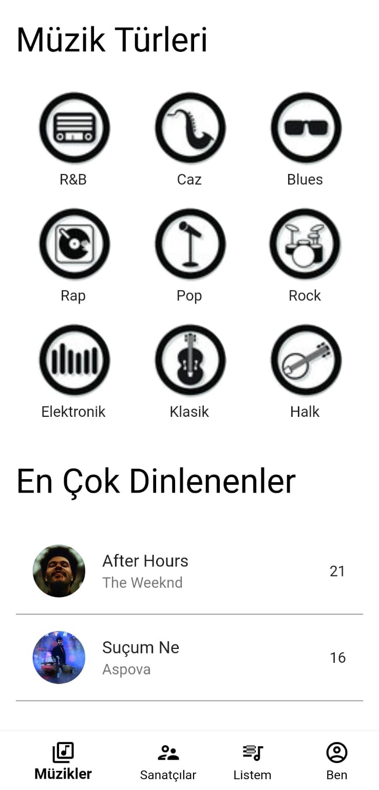</kbd>
<kbd>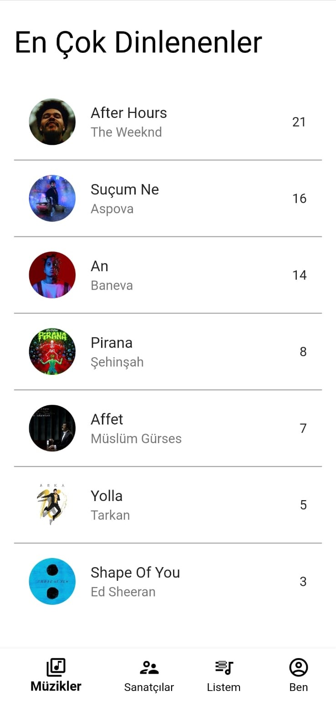</kbd>

## Player Page

<kbd>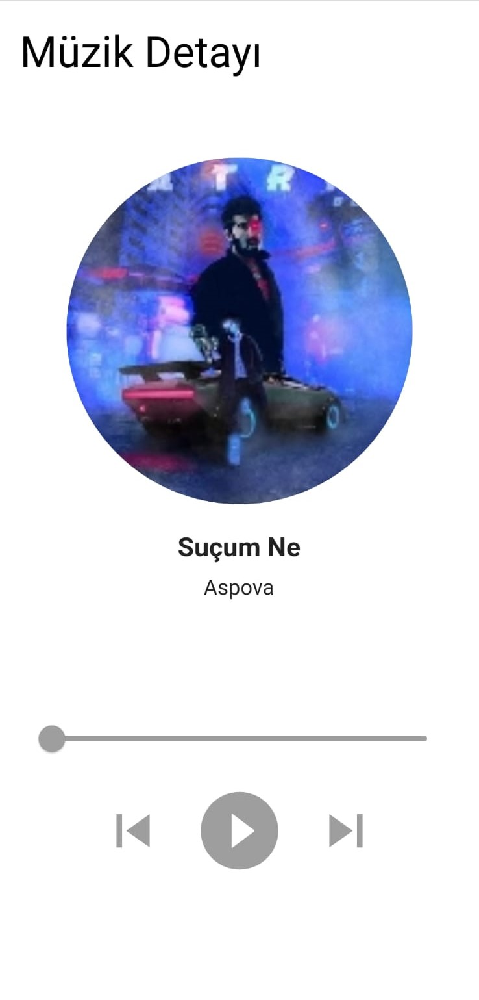</kbd>

## Login Page

<kbd>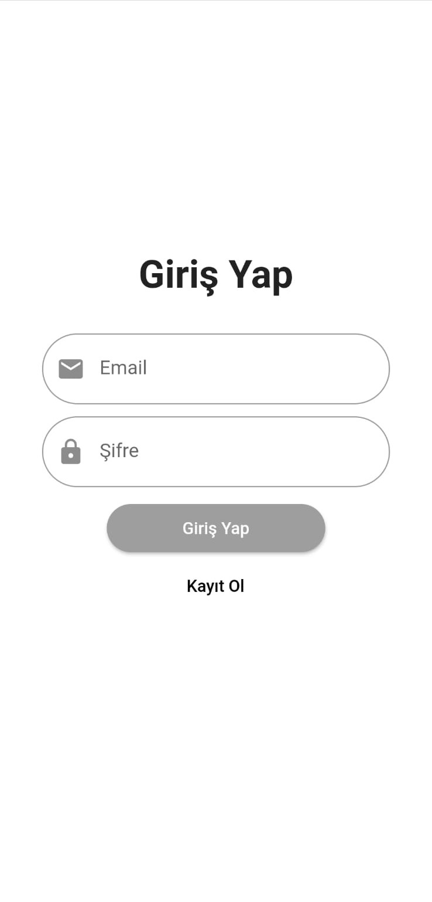</kbd>

## Register Page

<kbd>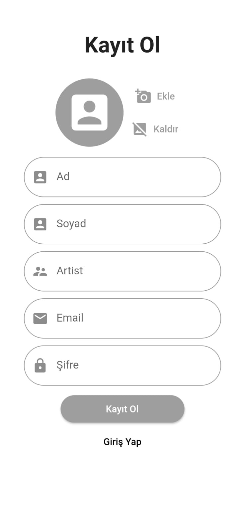</kbd>

## List Page

<kbd>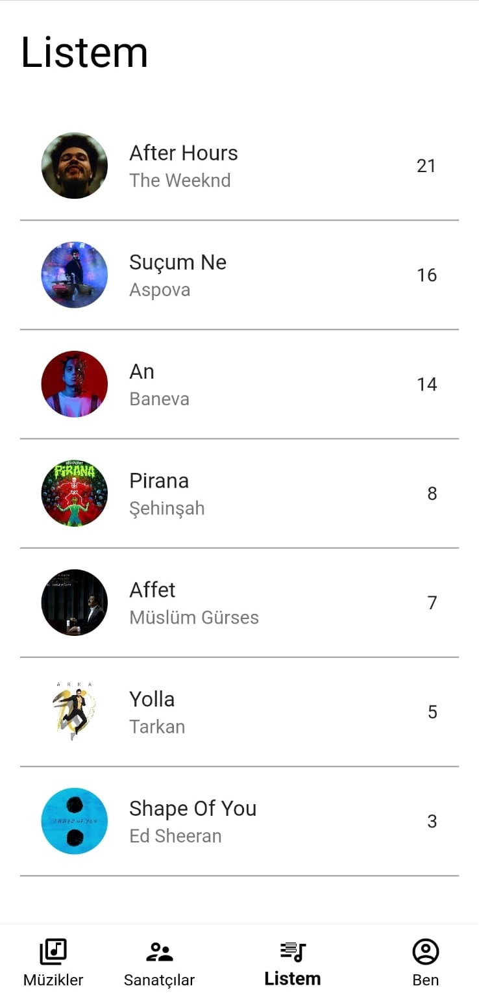</kbd>

## Artists Page

<kbd>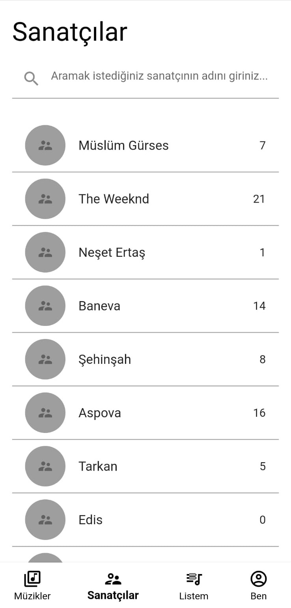</kbd>

## Profile Page

<kbd>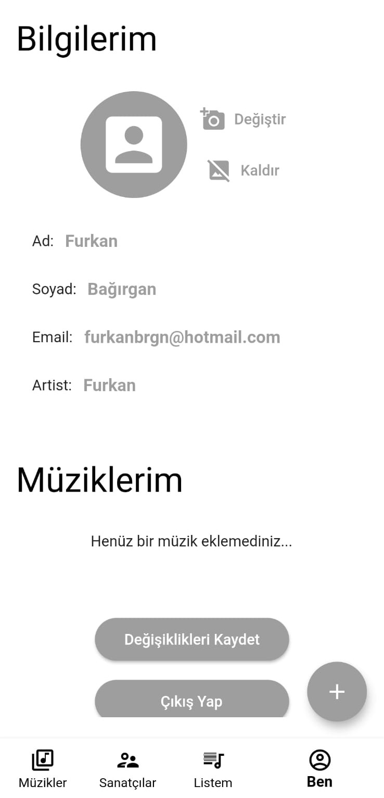</kbd>
<kbd>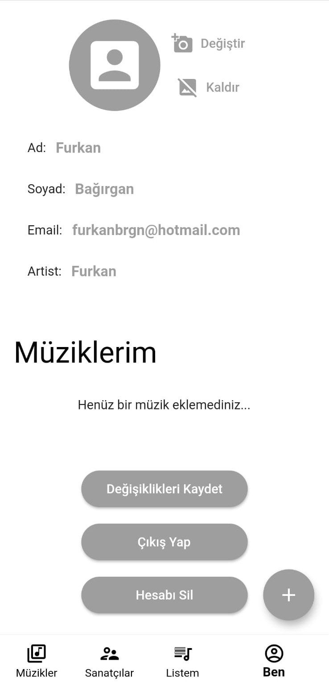</kbd>

## Add Music Page

<kbd>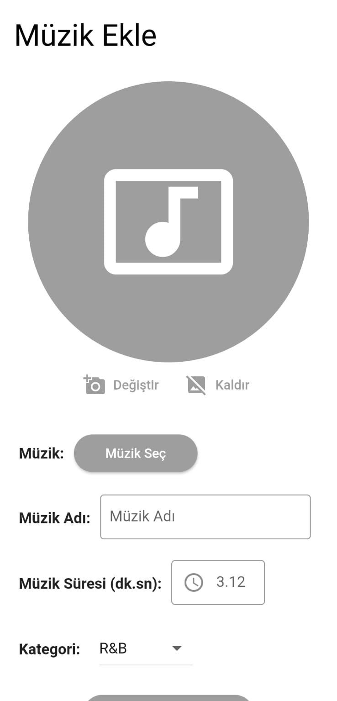</kbd>
<kbd>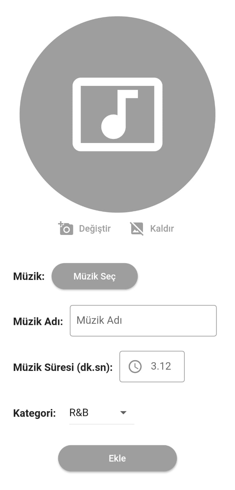</kbd>

## Getting Started

This project is a starting point for a Flutter application.

A few resources to get you started if this is your first Flutter project:

- [Lab: Write your first Flutter app](https://flutter.dev/docs/get-started/codelab)
- [Cookbook: Useful Flutter samples](https://flutter.dev/docs/cookbook)

For help getting started with Flutter, view our
[online documentation](https://flutter.dev/docs), which offers tutorials,
samples, guidance on mobile development, and a full API reference.
